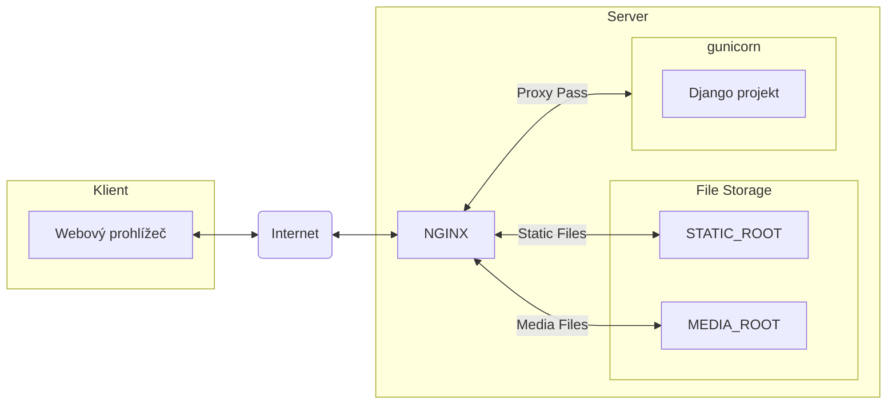

Produkční prostředí
===================

Doposud jsme vyvíjeli Django aplikaci na vývojovém serveru, který se spouští příkazem `python manage.py runserver`. Vývojový server je navržen tak, aby se s jeho pomocí aplikace snadno a rychle vyvíjela. Automaticky například detekuje změny v Python modulech, šablonách, poskytuje statické soubory a media soubory atd..


Před spuštěním Django aplikace v produkčním prostředí je potřeba provést následující kroky:

1. **Vypnutí debug módu**
    V souboru `settings.py` projektu vypněte debug mód:

    ```python
    # my_project/settings.py

    DEBUG = False
    ```

    Vypnutí debug módu má například následující důsledky:

    - **Chybové hlášky**: Django zobrazí uživatelsky přívětivé chybové stránky místo podrobných chybových zpráv, které jsou užitečné pro vývojáře. Tyto chybové stránky mohou být přizpůsobeny. 

    - **Bezpečnost**: Podrobné chybové zprávy, které jsou zobrazeny při zapnutém debug módu, mohou odhalit citlivé informace o vaší aplikaci. Nastavení `DEBUG = False` zvyšuje bezpečnost tím, že tyto informace skryje.
    
    - **Statické soubory**: Django nebude automaticky obsluhovat statické soubory. V produkčním prostředí by měly být statické soubory obsluhovány webovým serverem, jako je Nginx nebo Apache.

    - **Výkon**: Některé optimalizace a cacheování jsou aktivovány pouze při `DEBUG = False`, což může zlepšit výkon vaší aplikace.

2. **Nastavení `ALLOWED_HOSTS`**

    Musíte nastavit ALLOWED_HOSTS, což je seznam domén, které mohou obsluhovat vaši aplikaci. Pokud není správně nastaven, Django odmítne požadavky z neznámých domén.

    ```python
    # my_project/settings.py

    ALLOWED_HOSTS = ['example.com']
    ```
3. **Statické soubory**
    
    Před nasazením aplikace do produkčního prostředí je potřeba připravit statické soubory. Nejprve se ujistěte, že máte nastaven adresář STATIC_ROOT, kde bude webový server statické soubory hledat:

    ```python
    # my_project/settings.py

    STATIC_ROOT = BASE_DIR / 'static'
    ```
    Dále spustťe příkaz `collectstatic`, který zkopíruje všechny statické soubory do adresáře `STATIC_ROOT`:

    ```sh
    python manage.py collectstatic
    ```

4. **Media soubory**
    Media soubory jsou soubory nahrané uživateli, jako jsou obrázky, videa nebo dokumenty. Tyto soubory by měly být uloženy v adresáři, který je přístupný webovým serverem. Zkontrolujte proto nastavení `MEDIA_ROOT` v konfiguračním souboru `settings.py`:

    ```python
    # my_project/settings.py

    MEDIA_ROOT = BASE_DIR / 'media'
    MEDIA_URL = '/media/'
    ```

todo: SECRET_KEY

Nyní když máme aplikaci připravenu pro produkční prostředí, můžeme ji spustit v produkčním prostředí. Možností produkčních prostředí existuje celá řada, pojďme si některé ukázat.

NGINX + gunicorn + PostgreSQL
-----------------------------

### NGINX

NGINX je populární a výkoný webový server, který lze použít i po běh Django aplikací. Pro instalaci serveru NGINX na debian based linux distribucích použijte příkazy:

```sh
sudo apt update
sudo apt install nginx
```

Dále vytvořte nový konfigurační soubor pro váš projekt v `/etc/nginx/sites-available/`:
```nginx
# /etc/nginx/sites-available/myproject.com
server {
    listen 80;
    server_name myproject.com;

    location / {
        proxy_pass http://127.0.0.1:8000;
        proxy_set_header Host $host;
        proxy_set_header X-Real-IP $remote_addr;
        proxy_set_header X-Forwarded-For $proxy_add_x_forwarded_for;
        proxy_set_header X-Forwarded-Proto $scheme;
    }

    location /static/ {
        alias /path/to/your/project/static/;
    }

    location /media/ {
        alias /path/to/your/project/media/;
    }
}
```

A aktivujte nový konfigurační soubor:

```sh
sudo ln -s /etc/nginx/sites-available/yourproject /etc/nginx/sites-enabled/
sudo systemctl restart nginx
```

Více informací o konfiguraci NGINX serveru naleznete v [dokumentaci](https://docs.nginx.com/nginx/admin-guide/basic-functionality/managing-configuration-files/).

### gunicorn

Dále je potřeba spustit samotnou Django aplikaci, což lze udělat pomocí serveru `gunicorn`. Nejprve se ujistěte, že máte `gunicorn` nainstalovaný:

```sh
pip install gunicorn
```

A poté spusťte aplikaci pomocí `gunicorn`:

```sh
gunicorn --workers 3 my_project.wsgi:application
```

Tato konfigurace vytvoří nastavení, kdy server NGINX přebírá požadavky z Internetu, a pokud URL směřuje na adresář se statickými soubory (`STATIC_ROOT`), nebo na adresář s media soubory (`MEDIA_ROOT`), rovnou tyto soubory vrátí klientovi. Ostatní požadavky směřuje na server gunicorn, který má spuštěnou samotnou Django aplikaci, která požadavek zpracuje. Takové spojení jako zde (NGINX - gunicorn), kdy webserver přeposílá požadavky dalšímu serveru se označuje jako **Reverse Proxy** (**reverzní proxy**) případně **Proxy Pass**.



### PostgreSQL

PostgreSQL je výkonný a open-source relační databázový systém, který je často používán s Django aplikacemi. Následující kroky vás provedou instalací a konfigurací PostgreSQL pro vaši Django aplikaci.

1. **Instalace PostgreSQL**

    Na debian-based distribucích Linuxu můžete PostgreSQL nainstalovat pomocí následujících příkazů:

    ```sh
    sudo apt update
    sudo apt install postgresql postgresql-contrib
    ```

2. **Vytvoření databáze a uživatele**

    Po instalaci PostgreSQL je potřeba vytvořit novou databázi a uživatele. Nejprve se přihlaste do PostgreSQL shellu jako uživatel `postgres`:

    ```sh
    sudo -i -u postgres
    psql
    ```

    V PostgreSQL shellu vytvořte novou databázi a uživatele:

    ```sql
    CREATE DATABASE myproject;
    CREATE USER myprojectuser WITH PASSWORD 'password';
    ```

    Nastavte správná oprávnění pro nového uživatele:

    ```sql
    ALTER ROLE myprojectuser SET client_encoding TO 'utf8';
    ALTER ROLE myprojectuser SET default_transaction_isolation TO 'read committed';
    ALTER ROLE myprojectuser SET timezone TO 'UTC';
    GRANT ALL PRIVILEGES ON DATABASE myproject TO myprojectuser;
    ```

3. **Instalace PostgreSQL knihovny pro Python**

    Pro komunikaci s PostgreSQL z Django aplikace je potřeba nainstalovat knihovnu `psycopg2`:

    ```sh
    pip install psycopg2-binary
    ```

4. **Konfigurace Django projektu**

    Otevřete soubor `settings.py` ve vašem Django projektu a upravte nastavení `DATABASES`:

    ```python
    # my_project/settings.py
    
    DATABASES = {
        'default': {
            'ENGINE': 'django.db.backends.postgresql',
            'NAME': 'myproject',
            'USER': 'myprojectuser',
            'PASSWORD': 'password',
            'HOST': 'localhost',
            'PORT': '',
        }
    }
    ```

5. **Migrace databáze**

    Po konfiguraci databáze spusťte migrace, aby se vytvořily potřebné tabulky v PostgreSQL:

    ```sh
    python manage.py migrate
    ```


Google Cloud
------------

Google Cloud nabízí robustní a škálovatelné prostředí pro nasazení Django aplikací. Následující kroky vás provedou procesem nasazení Django projektu na Google Cloud.

1. **Vytvoření projektu na Google Cloud**

    Nejprve se přihlaste do Google Cloud Console a vytvořte nový projekt.

2. **Instalace Google Cloud SDK**

    Stáhněte a nainstalujte Google Cloud SDK podle [oficiální dokumentace](https://cloud.google.com/sdk/docs/install).

3. **Inicializace Google Cloud SDK**

    Přihlaste se do svého účtu Google a inicializujte SDK:

    ```sh
    gcloud init
    ```

4. **Nastavení App Engine**

    Povolení App Engine pro váš projekt:

    ```sh
    gcloud app create --project=[YOUR_PROJECT_ID]
    ```

5. **Konfigurace Django projektu**

    Vytvořte soubor `app.yaml` v kořenovém adresáři vašeho projektu s následujícím obsahem:

    ```yaml
    runtime: python39

    handlers:
    - url: /static
      static_dir: static/

    - url: /.*
      script: auto
    ```

6. **Nastavení databáze**

    Google Cloud nabízí několik možností pro databáze, jako je Cloud SQL. Pro připojení k databázi přidejte následující nastavení do `settings.py`:

    ```python
    DATABASES = {
        'default': {
            'ENGINE': 'django.db.backends.postgresql',
            'HOST': '/cloudsql/[YOUR_INSTANCE_CONNECTION_NAME]',
            'NAME': '[YOUR_DB_NAME]',
            'USER': '[YOUR_DB_USER]',
            'PASSWORD': '[YOUR_DB_PASSWORD]',
        }
    }
    ```

7. **Nasazení aplikace**

    Nasazení aplikace na Google App Engine:

    ```sh
    gcloud app deploy
    ```

8. **Přístup k aplikaci**

    Po úspěšném nasazení můžete přistupovat k vaší aplikaci na URL, kterou vám poskytne Google Cloud.

Více informací o nasazení Django aplikací na Google Cloud naleznete v [dokumentaci](https://cloud.google.com/python/django/appengine).


Použití SVS
-----------

SVS (Studentský vývojový server) je server spravovaný studenty Gymnázia Arabská. Základní informace o SVS naleznete na adrese [https://svs.gyarab.cz](https://svs.gyarab.cz). 

Návod jak spustit Django aplikaci naleznete zde:

[https://gist.github.com/kristiankunc/cc58b0d963d3a528f184c8863ce7a5fd](https://gist.github.com/kristiankunc/cc58b0d963d3a528f184c8863ce7a5fd)

